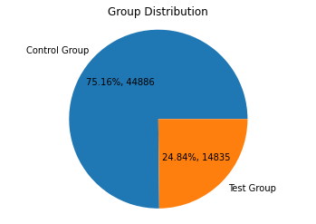
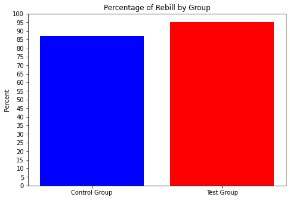
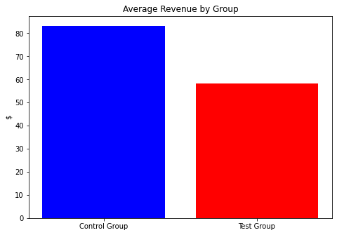
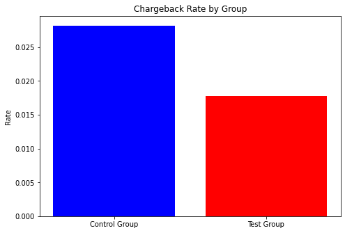

# 1. What is the aproximate probability distribution between the test group and the control group
Group Distribution\
Control Group: 75.1594916361079%\
Test Group: 24.8405083638921%

# 2. Is a user that must call-in to cancel more likely to generate at least 1 addition REBILL?
Percentage of Rebill by Group\
Control Group: 87.21037998146431%\
Test Group: 95.16819571865443%

# 3. Is a user that must call-in to cancel more likely to generate more revenues?
Average Revenue by Group\
Control Group: $83.26\
Test Group: $58.37

# 4. Is a user that must call-in more likely to produce a higher chargeback rate(CHARGEBACKs/REBILLs)?
Chargeback Rate by Group\
Control Group: 0.028221512247071354\
Test Group: 0.017784711388455537

